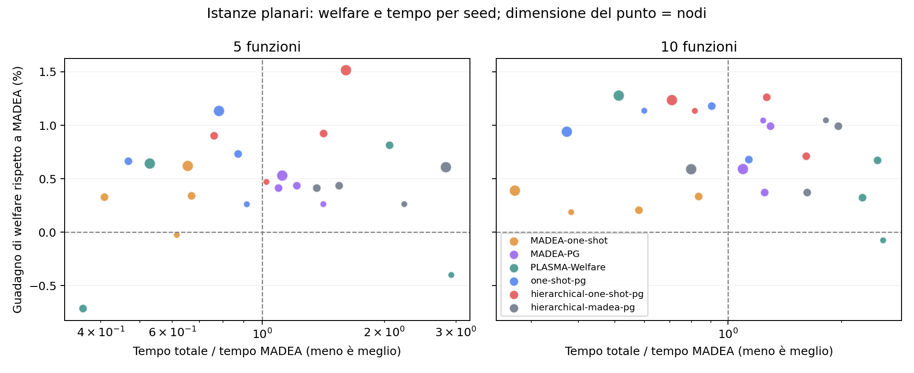

# Confronto planare con α > β — 1 ottobre 2026

Sono state corrette **35 istanze**, sostituendo l’intervallo di β/α 0,1–1,5 con 0,1–0,9 e ricalcolando δ, il beneficio dell’inoltro nell’obiettivo locale. Tutti gli altri parametri, le topologie e le tracce sono identici. Le copie originali restano disponibili. Il codice degli algoritmi non è stato modificato per questo confronto.

Su otto casi standard, il guadagno medio per istanza rispetto a MADEA è +0,58% per MADEA-PG, +0,84% per one-shot-PG e +1,02% per il gerarchico one-shot-PG. Il rapporto mediano del tempo one-shot-PG/MADEA è 0,827×, mentre gerarchico one-shot-PG/MADEA è 1,145×. Il gerarchico MADEA-PG dà +0,59% con rapporto temporale 1,720×: su questo campione la gerarchia aggiunge poco welfare a MADEA-PG.

Nei due casi stress, PLASMA-Welfare ha il welfare maggiore in entrambi. Nel caso a carico 1,5 dà +8,39% rispetto a MADEA; nel caso a carico 0,75 dà +0,60%. I due casi hanno numeri di funzioni diversi: non isolano il solo effetto del carico. Nelle due sequenze temporali il guadagno medio per timestep di PLASMA-Welfare è +1,53%. Non emerge un metodo migliore in ogni istanza e carico.

Il campione comprende **12 casi, non tutti i 35**, con 1–2 seed per gruppo standard. Le misure temporali sono singole esecuzioni. I grandi guadagni percentuali osservati nel vecchio assetto economico non ricompaiono sui casi standard qui misurati; questo non prova che la sola disuguaglianza fra α e β ne fosse la causa, perché cambiano anche δ e la distribuzione dei coefficienti.

Ogni confronto usa gli stessi dati, con topologia planare connessa e grado 3. Il welfare viene ricalcolato dagli output con la funzione comune e ogni soluzione viene verificata per ammissibilità e integrità delle allocazioni.

Esecuzioni riuscite: 84; timeout: 0; errori: 0. Le tabelle usano solo casi con tutti i metodi previsti riusciti: 12 gruppi, incluse eventuali ripetizioni.

Ogni cella mostra welfare medio e tempo mediano totale tra parentesi. Il tempo include avvio e chiusura del pool e scrittura degli output. Nei casi temporali il tempo si riferisce all’intera esecuzione di tre timestep; il welfare è la media dei timestep. Le ripetizioni non contano come nuovi seed.

Parallelismo richiesto per metodo: MADEA: 0; MADEA-one-shot: 0; MADEA-PG: 0; PLASMA-Welfare: 0; one-shot-pg: 0; hierarchical-one-shot-pg: 0; hierarchical-madea-pg: 0. Zero indica esecuzione sequenziale; un valore positivo indica il numero di processi.

MADEA e one-shot hanno al massimo 100 iterazioni. La fase PG ha al massimo cinque sweep e 0,25 secondi per nodo, limitati dal tempo restante: nativo nei metodi piatti, effettivo nelle due gerarchie PG. PLASMA-Welfare usa 20 round per timestep. I criteri d’arresto differiscono: non è un confronto a parità di tempo disponibile e non certifica l’ottimo globale.

Il carico deriva dalle tracce intere del generatore esistente. Nei casi stress è moltiplicato per 0,75 o 1,5; nei casi temporali per 0,75, 1,25 e 1 nei tre timestep, con arrotondamento numpy.rint. Il problema noto del resto in fixed_sum non è stato modificato; sono registrati i carichi effettivamente forniti a tutti i metodi.

Tutte le sette colonne sono rieseguite sulle nuove istanze con α > β. Grafi, α, γ, risorse e tracce originali sono identici. β/α è in [0,1; 0,9]; δ è ricalcolato dal generatore perché deriva da β. Sono corrette 35 istanze e misurati 12 casi selezionati, con seed 7, 42, 99 e 2026. Non confrontare direttamente questi welfare con quelli della precedente funzione obiettivo.

Hierarchical-one-shot-PG usa il motore gerarchico iterativo già esistente, profondità massima 3, inoltri solo tra vicini diretti e un raffinamento PG finale. Il budget totale usa il tempo effettivamente trascorso per timestep, incluso il coordinamento: max(30, 0,5 × N) secondi. Un singolo round o una proposta DP già avviati possono superare il budget; non è un timeout rigido. Le altre colonne conservano le rispettive misure e convenzioni temporali originali.

Nei 8 casi standard, rispetto a one-shot-PG il guadagno percentuale medio per istanza è +0.18% e il rapporto mediano dei tempi è 1.52×. PG migliora l’incumbent in 16 timestep su 16; in 0 timestep il budget PG è nullo.

## Carico standard

| Nodi | Funzioni | N. seed | MADEA | MADEA-one-shot | MADEA-PG | PLASMA-Welfare | one-shot-pg | hierarchical-one-shot-pg | hierarchical-madea-pg |
| --- | --- | --- | --- | --- | --- | --- | --- | --- | --- |
| 40 | 5 | 1 | 986.5 (1.29 s) | 986.3 (0.80 s) | 989.1 (1.83 s) | 982.6 (3.79 s) | 989.1 (1.19 s) | 991.1 (1.33 s) | 989.1 (2.90 s) |
| 40 | 10 | 1 | 1394.8 (3.23 s) | 1397.4 (1.24 s) | 1409.3 (4.00 s) | 1393.7 (8.34 s) | 1410.6 (1.93 s) | 1410.6 (2.64 s) | 1409.4 (5.88 s) |
| 80 | 5 | 2 | 1977.4 (5.10 s) | 1984.0 (2.63 s) | 1985.8 (5.85 s) | 1976.4 (5.40 s) | 1991.1 (3.23 s) | 1995.4 (5.25 s) | 1985.8 (7.34 s) |
| 80 | 10 | 2 | 3585.4 (7.28 s) | 3595.1 (5.07 s) | 3609.7 (9.28 s) | 3603.3 (17.30 s) | 3618.6 (7.35 s) | 3620.6 (10.37 s) | 3609.7 (13.16 s) |
| 160 | 5 | 1 | 4438.3 (15.63 s) | 4465.8 (10.25 s) | 4461.8 (17.51 s) | 4466.8 (8.26 s) | 4488.6 (12.23 s) | 4505.6 (25.14 s) | 4465.3 (44.33 s) |
| 160 | 10 | 1 | 8687.5 (64.77 s) | 8721.3 (17.57 s) | 8738.8 (70.91 s) | 8798.5 (33.18 s) | 8769.2 (24.15 s) | 8794.8 (45.93 s) | 8738.7 (51.67 s) |

## Carico più basso e più alto

| Nodi | Funzioni | Moltiplicatore | N. seed | MADEA | MADEA-one-shot | MADEA-PG | PLASMA-Welfare | one-shot-pg | hierarchical-one-shot-pg | hierarchical-madea-pg |
| --- | --- | --- | --- | --- | --- | --- | --- | --- | --- | --- |
| 80 | 5 | 0.75 | 1 | 1866.6 (3.84 s) | 1873.1 (2.60 s) | 1869.3 (5.17 s) | 1877.7 (3.94 s) | 1874.7 (3.70 s) | 1873.2 (5.81 s) | 1869.3 (11.21 s) |
| 80 | 10 | 1.5 | 1 | 2702.2 (9.16 s) | 2701.2 (4.33 s) | 2879.4 (11.48 s) | 2928.9 (32.83 s) | 2877.7 (6.99 s) | 2881.4 (10.46 s) | 2879.9 (22.47 s) |

## Tre timestep con carico variabile

| Nodi | Funzioni | N. seed | MADEA | MADEA-one-shot | MADEA-PG | PLASMA-Welfare | one-shot-pg | hierarchical-one-shot-pg | hierarchical-madea-pg |
| --- | --- | --- | --- | --- | --- | --- | --- | --- | --- |
| 40 | 10 | 1 | 1751.0 (5.21 s) | 1757.4 (3.84 s) | 1771.7 (7.01 s) | 1779.5 (15.62 s) | 1776.2 (5.56 s) | 1776.0 (6.46 s) | 1772.0 (13.69 s) |
| 80 | 5 | 1 | 1703.7 (18.04 s) | 1707.2 (7.72 s) | 1717.4 (22.40 s) | 1724.2 (24.76 s) | 1719.3 (11.75 s) | 1722.1 (18.84 s) | 1717.5 (39.11 s) |

## Welfare e tempo per istanza



Ogni punto è un caso e un metodo rispetto a MADEA sullo stesso input. A sinistra della linea verticale il metodo è più rapido; sopra la linea orizzontale ha welfare maggiore. I punti più grandi rappresentano più nodi.

## File di dettaglio

- [Risultati per esecuzione](runs.csv)
- [Welfare per istanza e timestep](welfare.csv)
- [Guadagni rispetto a MADEA](gain_vs_madea_pct.csv)
- [Metriche e verifiche](metrics.json)
- [Protocollo, configurazione e hash del codice](protocol.json)

## Verifiche e riproducibilità

Il confronto, inclusa la preparazione delle copie, è terminato in 22.07 minuti, entro il limite di 30 minuti. Tutte le 84 esecuzioni e i 112 risultati per timestep sono validi. Le quattro famiglie PG non peggiorano il proprio incumbent iniziale e hanno budget positivo in tutti i timestep.

Suite completa: **917 test passati e un fallimento preesistente**, `test_integer_fixed_sum_traces_preserve_system_workload`. Ruff, Mypy e controllo del diff sono passati. La revisione ha corretto una descrizione errata del parallelismo nel generatore del report; tutti i sette metodi sono stati misurati in sequenziale.

- [Audit delle 35 istanze e hash prima/dopo](instance_audit.csv)
- [Guadagni e rapporti temporali per metodo e fase](method_comparison.csv)
- [Configurazione economica corretta](corrected_config.json)
- [Verifiche, tempi e limiti del campione](verification.json)
- [Log della suite completa](full_suite.log)

Comando per ripetere su una nuova cartella:

```sh
MPLCONFIGDIR=/tmp/dfaas-mpl XDG_CACHE_HOME=/tmp/dfaas-test-cache .venv/bin/python experiments/madea_pg_compact/rerun_alpha_gt_beta.py --output solutions/families-alpha-gt-beta-repeat --seconds 1800
```

Gli snapshot `.txt` conservano il codice usato nel confronto. Il generatore del report misurato prima della correzione testuale del parallelismo è conservato nel relativo snapshot originale; `report_generator.py.txt` è la versione usata per produrre queste tabelle.
