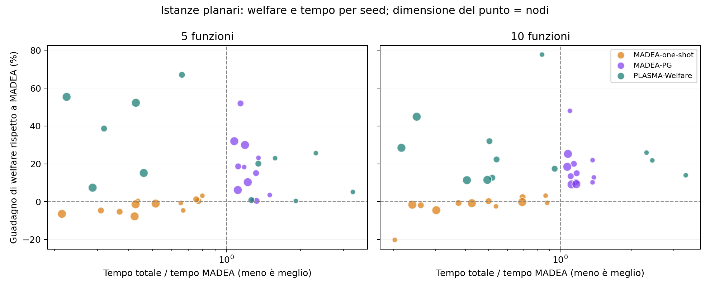

# Confronto planare delle famiglie MADEA e PLASMA-Welfare

**Aggiornamento:** è disponibile la [tabella con one-shot-pg e cinque metodi](../results_families_five_methods_2026_10_01/report.md).
Le misure originali qui conservate sono rimaste invariate.

Ogni confronto usa gli stessi dati, con topologia planare connessa e grado 3. Il welfare viene ricalcolato dagli output con la funzione comune e ogni soluzione viene verificata per ammissibilità e integrità delle allocazioni.

Esecuzioni riuscite: 140; timeout: 0; errori: 0. Le tabelle usano solo casi con tutti e quattro i metodi riusciti: 35 gruppi, incluse eventuali ripetizioni.

Ogni cella mostra welfare medio e tempo mediano totale tra parentesi. Il tempo include avvio e chiusura del pool e scrittura degli output. Nei casi temporali il tempo si riferisce all’intera esecuzione di tre timestep; il welfare è la media dei timestep. Le ripetizioni non contano come nuovi seed.

MADEA, one-shot e MADEA-PG usano la DP sequenziale; PLASMA-Welfare usa quattro processi. Il pilot con quattro processi anche per MADEA è conservato separatamente: la spedizione degli input completi ai worker può superare il costo della piccola DP. Quindi questi risultati confrontano le configurazioni accelerate scelte, non lo stesso numero di core.

MADEA e one-shot hanno al massimo 100 iterazioni. La fase PG ha al massimo cinque sweep e 0,25 secondi per nodo, limitati dal tempo nativo restante. PLASMA-Welfare usa 20 round per timestep. I criteri d’arresto differiscono: non è un confronto a parità di tempo disponibile e non certifica l’ottimo globale.

Il carico deriva dalle tracce intere del generatore esistente. Nei casi stress è moltiplicato per 0,75 o 1,5; nei casi temporali per 0,75, 1,25 e 1 nei tre timestep, con arrotondamento numpy.rint. Il problema noto del resto in fixed_sum non è stato modificato; sono registrati i carichi effettivamente forniti a tutti i metodi.

## Carico standard

| Nodi | Funzioni | Seed | MADEA | MADEA-one-shot | MADEA-PG | PLASMA-Welfare |
| --- | --- | --- | --- | --- | --- | --- |
| 40 | 5 | 4 | 866.5 (1.65 s) | 864.7 (1.09 s) | 963.3 (2.33 s) | 982.1 (3.91 s) |
| 40 | 10 | 4 | 1452.3 (2.75 s) | 1402.3 (1.73 s) | 1749.3 (3.76 s) | 1896.6 (7.14 s) |
| 80 | 5 | 4 | 1698.5 (7.07 s) | 1671.8 (3.28 s) | 1988.2 (8.50 s) | 2137.9 (5.70 s) |
| 80 | 10 | 4 | 3204.4 (13.94 s) | 3202.9 (6.06 s) | 3674.4 (15.84 s) | 3882.5 (10.04 s) |
| 160 | 5 | 4 | 3647.6 (28.16 s) | 3517.1 (11.99 s) | 4282.7 (33.98 s) | 4685.5 (12.12 s) |
| 160 | 10 | 4 | 7227.9 (64.84 s) | 7105.6 (22.84 s) | 8318.7 (70.95 s) | 8904.8 (19.73 s) |

## Carico più basso e più alto

| Nodi | Funzioni | Moltiplicatore | Seed | MADEA | MADEA-one-shot | MADEA-PG | PLASMA-Welfare |
| --- | --- | --- | --- | --- | --- | --- | --- |
| 80 | 5 | 0.75 | 2 | 1508.2 (7.34 s) | 1451.0 (3.39 s) | 1915.2 (8.59 s) | 2015.4 (5.47 s) |
| 80 | 5 | 1.5 | 2 | 1065.3 (4.98 s) | 1072.8 (3.70 s) | 1410.2 (6.55 s) | 1474.3 (7.54 s) |
| 80 | 10 | 0.75 | 2 | 3228.4 (9.40 s) | 3164.4 (5.95 s) | 3662.1 (13.60 s) | 3726.0 (7.49 s) |
| 80 | 10 | 1.5 | 2 | 2366.1 (13.04 s) | 2379.4 (6.22 s) | 2726.2 (14.91 s) | 2840.7 (9.82 s) |

## Tre timestep con carico variabile

| Nodi | Funzioni | Seed | MADEA | MADEA-one-shot | MADEA-PG | PLASMA-Welfare |
| --- | --- | --- | --- | --- | --- | --- |
| 40 | 5 | 1 | 798.6 (5.19 s) | 790.5 (3.30 s) | 978.4 (7.05 s) | 1019.0 (10.31 s) |
| 40 | 10 | 1 | 1623.2 (9.61 s) | 1609.6 (4.94 s) | 1812.1 (11.66 s) | 1908.5 (12.49 s) |
| 80 | 5 | 1 | 1511.0 (18.36 s) | 1510.1 (10.68 s) | 1721.4 (22.62 s) | 1784.3 (14.87 s) |

## Welfare e tempo per istanza

Ogni punto è un caso e un metodo rispetto a MADEA sullo stesso input. A sinistra della linea verticale il metodo è più rapido; sopra la linea orizzontale ha welfare maggiore. I punti più grandi rappresentano più nodi.

## File di dettaglio

- [Risultati per esecuzione](runs.csv)
- [Welfare per istanza e timestep](welfare.csv)
- [Guadagni rispetto a MADEA](gain_vs_madea_pct.csv)
- [Metriche e verifiche](metrics.json)
- [Protocollo, configurazione e hash del codice](protocol.json)

## Lettura dei risultati

Nei 24 casi standard, MADEA-PG migliora il welfare rispetto a MADEA in tutti
i casi: guadagno percentuale medio +17,7%. PLASMA-Welfare migliora in tutti
i casi, con media +26,3%, e ha il welfare più alto in 22 casi su 24.
MADEA-PG prevale nel caso con 40 nodi, 5 funzioni e seed 42; one-shot
prevale con 80 nodi, 5 funzioni e seed 2026. One-shot è generalmente più
rapida, ma il suo guadagno medio di welfare rispetto a MADEA è −2,3%.
Queste percentuali sono medie dei guadagni per istanza, non rapporti tra
le medie di welfare della tabella.

PLASMA-Welfare è più lenta sulle istanze da 40 nodi. Nei gruppi da 160 nodi
ha invece welfare maggiore e tempo mediano minore: con 10 funzioni circa
20 secondi, contro 65 di MADEA e 71 di MADEA-PG. Sono tempi del simulatore
su una macchina, con sequenziale per MADEA e quattro processi per PLASMA.

Negli otto casi di carico modificato, il guadagno medio è +23,0% per
MADEA-PG e +27,9% per PLASMA-Welfare. Le tre sequenze temporali completate
usano soltanto il seed 7 e nove timestep complessivi: i guadagni medi sono
+16,0% e +21,2%. È una verifica preliminare su carico variabile, non una
misura della convergenza o delle oscillazioni a lungo termine.

L'esperimento è terminato alle 09:48:03 UTC, prima della scadenza delle
09:49 UTC: 140 esecuzioni riuscite, nessun errore o timeout. La parte
restante del piano e le ripetizioni di timing non sono state eseguite
per rispettare il limite. Gli hash del codice degli algoritmi sono
rimasti invariati; sono disponibili in [verification.json](verification.json)
e nel protocollo.
