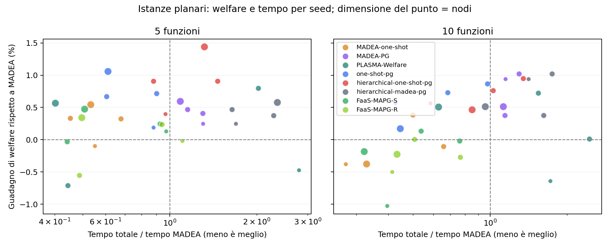

# Confronto planare con PG da solo — 9 ottobre 2026

Ogni confronto usa gli stessi dati, con topologia planare connessa e grado 3. Il welfare viene ricalcolato dagli output con la funzione comune e ogni soluzione viene verificata per ammissibilità e integrità delle allocazioni.

Esecuzioni riuscite: 108; timeout: 0; errori: 0. Le tabelle usano solo casi con tutti i metodi previsti riusciti: 12 gruppi, incluse eventuali ripetizioni.

Ogni cella mostra welfare medio e tempo mediano totale tra parentesi. Il tempo include avvio e chiusura del pool e scrittura degli output. Nei casi temporali il tempo si riferisce all’intera esecuzione di tre timestep; il welfare è la media dei timestep. Le ripetizioni non contano come nuovi seed.

Parallelismo richiesto per metodo: MADEA: 0; MADEA-one-shot: 0; MADEA-PG: 0; PLASMA-Welfare: 0; one-shot-pg: 0; hierarchical-one-shot-pg: 0; hierarchical-madea-pg: 0; FaaS-MAPG-S: 0; FaaS-MAPG-R: 0. Zero indica esecuzione sequenziale; un valore positivo indica il numero di processi.

MADEA e one-shot hanno al massimo 100 iterazioni. La fase PG ha al massimo cinque sweep e 0,25 secondi per nodo, limitati dal tempo nativo restante. PLASMA-Welfare usa 20 round per timestep. I criteri d’arresto differiscono: non è un confronto a parità di tempo disponibile e non certifica l’ottimo globale.

Il carico deriva dalle tracce intere del generatore esistente. Nei casi stress è moltiplicato per 0,75 o 1,5; nei casi temporali per 0,75, 1,25 e 1 nei tre timestep, con arrotondamento numpy.rint. Il problema noto del resto in fixed_sum non è stato modificato; sono registrati i carichi effettivamente forniti a tutti i metodi.

Stesse 12 istanze α > β della campagna del 1° ottobre (hash verificati). Tutti i metodi sono rieseguiti sul codice attuale, con DP locale attiva; si aggiungono FaaS-MAPG-S e FaaS-MAPG-R (PG da solo, ordine fisso e casuale), con al massimo 100 iterazioni e lo stesso TimeLimit max(30, 0,5 × N).

Hierarchical-one-shot-PG usa il motore gerarchico iterativo già esistente, profondità massima 3, inoltri solo tra vicini diretti e un raffinamento PG finale. Il budget totale usa il tempo effettivamente trascorso per timestep, incluso il coordinamento: max(30, 0,5 × N) secondi. Un singolo round o una proposta DP già avviati possono superare il budget; non è un timeout rigido. Le altre colonne conservano le rispettive misure e convenzioni temporali originali.

Nei 8 casi standard, rispetto a one-shot-PG il guadagno percentuale medio per istanza è +0.18% e il rapporto mediano dei tempi è 1.48×. PG migliora l’incumbent in 16 timestep su 16; in 0 timestep il budget PG è nullo.

## Sintesi: PG da solo contro gli altri metodi

Campagna del 9 ottobre 2026: le stesse 12 istanze α > β del confronto del 1° ottobre (hash dei metadati verificati), tutti i nove metodi rieseguiti sul codice attuale, in sequenza, con DP locale attiva. Esecuzioni riuscite 108 su 108; ogni soluzione è verificata per ammissibilità e interezza.

Guadagno medio di welfare per istanza rispetto a MADEA (welfare ricalcolato dagli output), numero di casi standard in cui il metodo è il migliore (parità incluse) e rapporto mediano dei tempi totali rispetto a MADEA su tutti i 12 casi:

| Metodo | Standard (8) | Stress (2) | Temporale (2) | Migliore (standard) | Tempo / MADEA (mediana) |
| --- | --- | --- | --- | --- | --- |
| MADEA | +0.00% | +0.00% | +0.00% | 0 | 1.00× |
| MADEA-one-shot | +0.08% | -0.07% | +0.19% | 0 | 0.53× |
| MADEA-PG | +0.57% | +3.33% | +1.02% | 3 | 1.19× |
| one-shot-pg | +0.62% | +3.23% | +1.15% | 0 | 0.69× |
| hierarchical-madea-pg | +0.56% | +3.37% | +1.03% | 3 | 1.93× |
| hierarchical-one-shot-pg | +0.80% | +3.26% | +1.23% | 5 | 1.06× |
| PLASMA-Welfare | +0.10% | +4.26% | +1.42% | 0 | 1.63× |
| FaaS-MAPG-S | -0.04% | +3.24% | +0.69% | 0 | 0.62× |
| FaaS-MAPG-R | -0.12% | +2.96% | +0.54% | 0 | 0.60× |

- **PG da solo (FaaS-MAPG-S/R) è veloce ma non migliora MADEA sui casi standard**: −0,04% (S) e −0,12% (R), con circa il 60% del tempo di MADEA. Non è mai il migliore.
- **Sotto carico alto** (80 nodi, 10 funzioni, ×1,5) PG-S (2879,5) è allineato a MADEA-PG (2878,8) e one-shot-PG (2877,7), sotto PLASMA-Welfare (2928,9).
- **Usato come raffinamento vale di più che da solo**: one-shot-PG (+0,62%) e il gerarchico one-shot-PG (+0,80%, migliore in 5 casi standard su 8) partono dall'asta e restano davanti a PG da solo su ogni gruppo standard.
- **L'ordine fisso (S) batte quello casuale (R)** in media in tutte e tre le fasi.
- Tutte le 32 esecuzioni per timestep di PG-S/R si fermano con **equilibrio ε-Nash certificato**, dopo 2–5 iterazioni (mediana 3): PG converge rapidamente a un equilibrio, ma a un equilibrio peggiore di quello raggiunto partendo dall'asta.

Nota sul codice: prima della campagna è stato corretto `potential_game_sweep`, che non arrotondava la capacità residua dei vicini e produceva flussi frazionari, non ammissibili per il modello intero; ora usa flussi interi come `refine_solution`. Rispetto al 1° ottobre cambiano anche MADEA (correzioni dell'asta dell'8 ottobre) e l'attivazione della DP, quindi i valori assoluti non vanno mescolati con quelli della campagna precedente.

## Carico standard

| Nodi | Funzioni | N. seed | MADEA | MADEA-one-shot | MADEA-PG | PLASMA-Welfare | one-shot-pg | hierarchical-one-shot-pg | hierarchical-madea-pg | FaaS-MAPG-S | FaaS-MAPG-R |
| --- | --- | --- | --- | --- | --- | --- | --- | --- | --- | --- | --- |
| 40 | 5 | 1 | 987.2 (1.38 s) | 986.3 (0.76 s) | 989.7 (1.79 s) | 982.6 (3.85 s) | 989.1 (1.21 s) | 991.1 (1.33 s) | 989.7 (2.33 s) | 988.5 (1.34 s) | 987.0 (1.52 s) |
| 40 | 10 | 1 | 1402.7 (4.50 s) | 1397.4 (1.23 s) | 1415.9 (5.16 s) | 1393.7 (7.73 s) | 1410.6 (1.92 s) | 1410.6 (2.63 s) | 1415.9 (6.36 s) | 1388.3 (1.78 s) | 1395.7 (1.86 s) |
| 80 | 5 | 2 | 1977.5 (4.83 s) | 1984.0 (2.65 s) | 1986.2 (5.87 s) | 1976.4 (5.42 s) | 1991.1 (3.53 s) | 1995.4 (5.46 s) | 1986.0 (9.27 s) | 1979.3 (3.14 s) | 1973.4 (3.29 s) |
| 80 | 10 | 2 | 3590.0 (9.31 s) | 3595.1 (5.25 s) | 3614.9 (11.22 s) | 3603.3 (17.78 s) | 3618.6 (7.47 s) | 3620.6 (10.78 s) | 3614.9 (15.56 s) | 3592.1 (5.84 s) | 3585.3 (5.69 s) |
| 160 | 5 | 1 | 4441.7 (19.15 s) | 4465.8 (10.20 s) | 4468.1 (20.82 s) | 4466.8 (7.70 s) | 4488.6 (11.71 s) | 4505.6 (25.23 s) | 4467.3 (45.09 s) | 4462.7 (9.72 s) | 4456.8 (9.50 s) |
| 160 | 10 | 1 | 8754.2 (53.50 s) | 8721.3 (17.59 s) | 8799.0 (60.25 s) | 8798.5 (33.64 s) | 8769.2 (23.83 s) | 8794.8 (45.48 s) | 8799.0 (51.21 s) | 8738.1 (17.22 s) | 8734.4 (23.14 s) |

## Carico più basso e più alto

| Nodi | Funzioni | Moltiplicatore | N. seed | MADEA | MADEA-one-shot | MADEA-PG | PLASMA-Welfare | one-shot-pg | hierarchical-one-shot-pg | hierarchical-madea-pg | FaaS-MAPG-S | FaaS-MAPG-R |
| --- | --- | --- | --- | --- | --- | --- | --- | --- | --- | --- | --- | --- |
| 80 | 5 | 0.75 | 1 | 1875.0 (4.97 s) | 1873.1 (2.58 s) | 1877.6 (5.67 s) | 1877.7 (3.98 s) | 1874.7 (3.50 s) | 1873.2 (6.21 s) | 1879.2 (19.63 s) | 1873.5 (3.06 s) | 1866.3 (3.09 s) |
| 80 | 10 | 1.5 | 1 | 2702.5 (7.82 s) | 2701.2 (4.68 s) | 2878.8 (10.15 s) | 2928.9 (33.21 s) | 2877.7 (6.85 s) | 2881.4 (10.64 s) | 2878.8 (17.34 s) | 2879.5 (5.59 s) | 2875.2 (5.48 s) |

## Tre timestep con carico variabile

| Nodi | Funzioni | N. seed | MADEA | MADEA-one-shot | MADEA-PG | PLASMA-Welfare | one-shot-pg | hierarchical-one-shot-pg | hierarchical-madea-pg | FaaS-MAPG-S | FaaS-MAPG-R |
| --- | --- | --- | --- | --- | --- | --- | --- | --- | --- | --- | --- |
| 40 | 10 | 1 | 1752.5 (6.35 s) | 1757.4 (3.70 s) | 1771.7 (8.08 s) | 1779.5 (15.68 s) | 1776.2 (5.65 s) | 1776.0 (6.59 s) | 1772.0 (15.00 s) | 1762.8 (5.20 s) | 1761.2 (4.84 s) |
| 80 | 5 | 1 | 1705.9 (17.48 s) | 1707.2 (7.79 s) | 1719.3 (21.34 s) | 1724.2 (25.29 s) | 1719.3 (11.62 s) | 1722.1 (19.01 s) | 1719.3 (37.05 s) | 1717.0 (10.84 s) | 1713.5 (10.25 s) |

## Welfare e tempo per istanza

Ogni punto è un caso e un metodo rispetto a MADEA sullo stesso input. A sinistra della linea verticale il metodo è più rapido; sopra la linea orizzontale ha welfare maggiore. I punti più grandi rappresentano più nodi.

## File di dettaglio

- [Risultati per esecuzione](runs.csv)
- [Welfare per istanza e timestep](welfare.csv)
- [Guadagni rispetto a MADEA](gain_vs_madea_pct.csv)
- [Metriche e verifiche](metrics.json)
- [Protocollo, configurazione e hash del codice](protocol.json)
