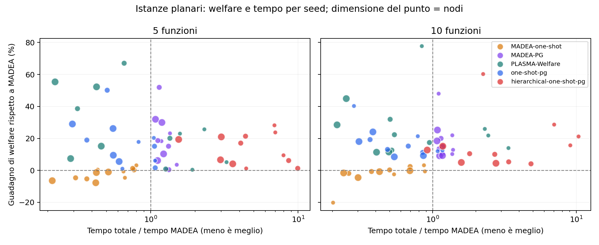

# Confronto planare delle famiglie MADEA e PLASMA-Welfare

Ogni confronto usa gli stessi dati, con topologia planare connessa e grado 3. Il welfare viene ricalcolato dagli output con la funzione comune e ogni soluzione viene verificata per ammissibilità e integrità delle allocazioni.

Esecuzioni riuscite: 210; timeout: 0; errori: 0. Le tabelle usano solo casi con tutti i metodi previsti riusciti: 35 gruppi, incluse eventuali ripetizioni.

Ogni cella mostra welfare medio e tempo mediano totale tra parentesi. Il tempo include avvio e chiusura del pool e scrittura degli output. Nei casi temporali il tempo si riferisce all’intera esecuzione di tre timestep; il welfare è la media dei timestep. Le ripetizioni non contano come nuovi seed.

MADEA e le sue varianti usano la DP sequenziale; PLASMA-Welfare usa quattro processi. Il pilot con quattro processi anche per MADEA è conservato separatamente: la spedizione degli input completi ai worker può superare il costo della piccola DP. Quindi questi risultati confrontano le configurazioni accelerate scelte, non lo stesso numero di core.

MADEA e one-shot hanno al massimo 100 iterazioni. La fase PG ha al massimo cinque sweep e 0,25 secondi per nodo, limitati dal tempo nativo restante. PLASMA-Welfare usa 20 round per timestep. I criteri d’arresto differiscono: non è un confronto a parità di tempo disponibile e non certifica l’ottimo globale.

Il carico deriva dalle tracce intere del generatore esistente. Nei casi stress è moltiplicato per 0,75 o 1,5; nei casi temporali per 0,75, 1,25 e 1 nei tre timestep, con arrotondamento numpy.rint. Il problema noto del resto in fixed_sum non è stato modificato; sono registrati i carichi effettivamente forniti a tutti i metodi.

La colonna hierarchical-one-shot-pg è stata aggiunta con una sessione successiva, eseguendo solo questo metodo sugli stessi file di input e con la stessa configurazione. I risultati dei 5 metodi precedenti sono conservati integralmente. I tempi provengono quindi da sessioni distinte sulla stessa macchina.

Hierarchical-one-shot-PG usa il motore gerarchico iterativo già esistente, profondità massima 3, inoltri solo tra vicini diretti e un raffinamento PG finale. Il budget gerarchico usa il tempo effettivamente trascorso per timestep, incluso il coordinamento: max(30, 0,5 × N) secondi. Un singolo round o una proposta DP già avviati possono superare il budget; non è un timeout rigido. Le altre colonne conservano le rispettive misure e convenzioni temporali originali.

Nei 24 casi standard, rispetto a one-shot-PG il guadagno percentuale medio per istanza è -1.78% e il rapporto mediano dei tempi è 6.24×. PG migliora l’incumbent in 14 timestep su 41; in 27 timestep la gerarchia esaurisce il budget e PG non avvia proposte. La variante è quindi funzionante, ma questa configurazione non migliora complessivamente one-shot-PG.

La prima finestra di 30 minuti ha completato 34 casi. L’ultima sequenza temporale è stata eseguita separatamente in 60,23 secondi, con gli stessi input e senza cambiare il codice; le misure interrotte prima della correzione del criterio d’arresto sono escluse.

## Carico standard

| Nodi | Funzioni | Seed | MADEA | MADEA-one-shot | MADEA-PG | PLASMA-Welfare | one-shot-pg | hierarchical-one-shot-pg |
| --- | --- | --- | --- | --- | --- | --- | --- | --- |
| 40 | 5 | 4 | 866.5 (1.65 s) | 864.7 (1.09 s) | 963.3 (2.33 s) | 982.1 (3.91 s) | 963.8 (1.44 s) | 1001.9 (11.39 s) |
| 40 | 10 | 4 | 1452.3 (2.75 s) | 1402.3 (1.73 s) | 1749.3 (3.76 s) | 1896.6 (7.14 s) | 1733.6 (2.42 s) | 1862.4 (21.13 s) |
| 80 | 5 | 4 | 1698.5 (7.07 s) | 1671.8 (3.28 s) | 1988.2 (8.50 s) | 2137.9 (5.70 s) | 1991.3 (4.59 s) | 1863.6 (41.16 s) |
| 80 | 10 | 4 | 3204.4 (13.94 s) | 3202.9 (6.06 s) | 3674.4 (15.84 s) | 3882.5 (10.04 s) | 3673.1 (7.92 s) | 3448.4 (42.13 s) |
| 160 | 5 | 4 | 3647.6 (28.16 s) | 3517.1 (11.99 s) | 4282.7 (33.98 s) | 4685.5 (12.12 s) | 4217.6 (15.66 s) | 4059.9 (84.01 s) |
| 160 | 10 | 4 | 7227.9 (64.84 s) | 7105.6 (22.84 s) | 8318.7 (70.95 s) | 8904.8 (19.73 s) | 8279.6 (29.09 s) | 7881.4 (88.20 s) |

## Carico più basso e più alto

| Nodi | Funzioni | Moltiplicatore | Seed | MADEA | MADEA-one-shot | MADEA-PG | PLASMA-Welfare | one-shot-pg | hierarchical-one-shot-pg |
| --- | --- | --- | --- | --- | --- | --- | --- | --- | --- |
| 80 | 5 | 0.75 | 2 | 1508.2 (7.34 s) | 1451.0 (3.39 s) | 1915.2 (8.59 s) | 2015.4 (5.47 s) | 1901.9 (4.65 s) | 1681.3 (41.17 s) |
| 80 | 5 | 1.5 | 2 | 1065.3 (4.98 s) | 1072.8 (3.70 s) | 1410.2 (6.55 s) | 1474.3 (7.54 s) | 1409.6 (5.29 s) | 1134.5 (41.25 s) |
| 80 | 10 | 0.75 | 2 | 3228.4 (9.40 s) | 3164.4 (5.95 s) | 3662.1 (13.60 s) | 3726.0 (7.49 s) | 3645.5 (7.59 s) | 3415.4 (41.77 s) |
| 80 | 10 | 1.5 | 2 | 2366.1 (13.04 s) | 2379.4 (6.22 s) | 2726.2 (14.91 s) | 2840.7 (9.82 s) | 2731.3 (8.12 s) | 2448.1 (42.17 s) |

## Tre timestep con carico variabile

| Nodi | Funzioni | Seed | MADEA | MADEA-one-shot | MADEA-PG | PLASMA-Welfare | one-shot-pg | hierarchical-one-shot-pg |
| --- | --- | --- | --- | --- | --- | --- | --- | --- |
| 40 | 5 | 1 | 798.6 (5.19 s) | 790.5 (3.30 s) | 978.4 (7.05 s) | 1019.0 (10.31 s) | 976.5 (4.91 s) | 1033.8 (35.37 s) |
| 40 | 10 | 1 | 1623.2 (9.61 s) | 1609.6 (4.94 s) | 1812.1 (11.66 s) | 1908.5 (12.49 s) | 1801.5 (6.78 s) | 1905.3 (60.23 s) |
| 80 | 5 | 1 | 1511.0 (18.36 s) | 1510.1 (10.68 s) | 1721.4 (22.62 s) | 1784.3 (14.87 s) | 1716.7 (14.57 s) | 1589.7 (123.19 s) |

## Welfare e tempo per istanza

Ogni punto è un caso e un metodo rispetto a MADEA sullo stesso input. A sinistra della linea verticale il metodo è più rapido; sopra la linea orizzontale ha welfare maggiore. I punti più grandi rappresentano più nodi.

## File di dettaglio

- [Risultati per esecuzione](runs.csv)
- [Welfare per istanza e timestep](welfare.csv)
- [Guadagni rispetto a MADEA](gain_vs_madea_pct.csv)
- [Metriche e verifiche](metrics.json)
- [Protocollo, configurazione e hash del codice](protocol.json)

## Verifica del codice

La fase PG resta basata sull’utilità del nodo proponente e sulle capacità dei vicini. La selezione storica dell’incumbent tramite welfare era già presente nel runner gerarchico; non viene introdotta dalla fase PG. La gerarchia non autorizza inoltri verso nodi non adiacenti.

La suite completa sul codice finale ha dato 907 test passati e un fallimento preesistente: `tests/test_review_optimization_regressions.py::test_integer_fixed_sum_traces_preserve_system_workload`. I due precedenti errori del runner gerarchico sono risolti. I test mirati controllano anche che le repliche appena avviate siano utilizzate prima dell’arresto, l’identità con la baseline a budget PG nullo e decisioni PG identiche alterando l’osservatore globale del welfare.

La [verifica finale](verification.json) conferma 175 esecuzioni e 205 osservazioni precedenti conservate, 35 nuove esecuzioni e 41 nuove osservazioni, gli hash del codice invariati durante la raccolta e le cinque colonne precedenti immutate. Gli script della raccolta e del completamento sono salvati qui come snapshot.
